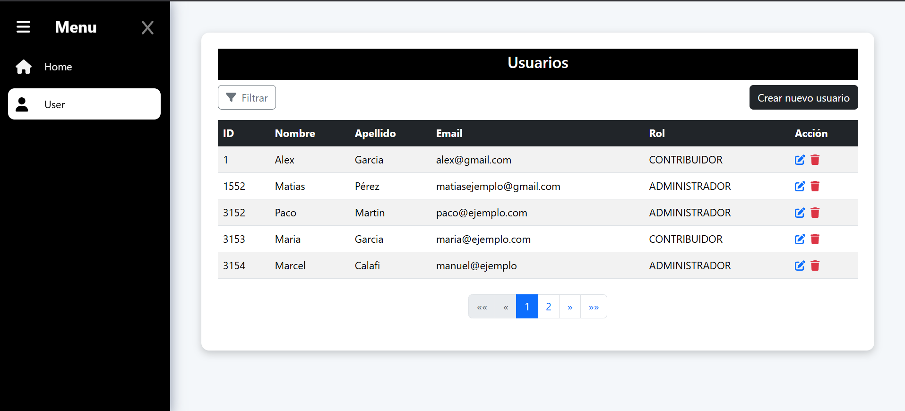
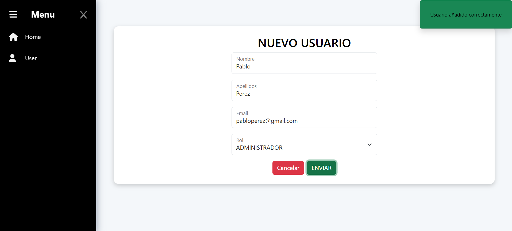
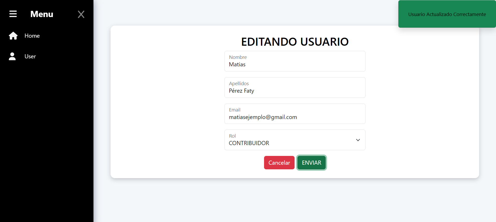
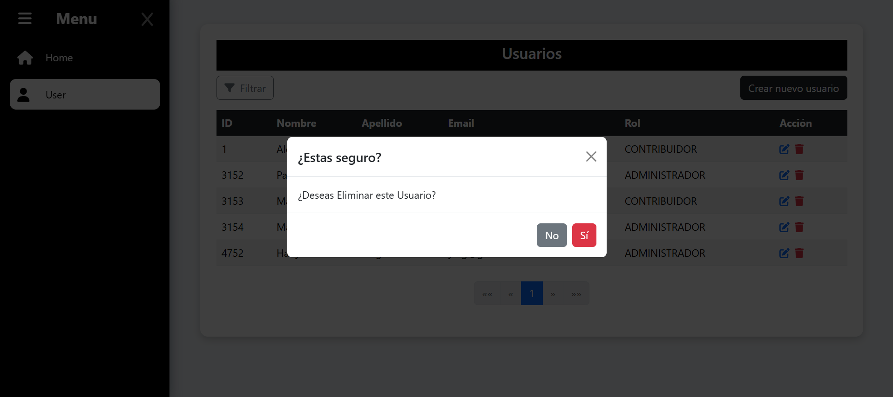
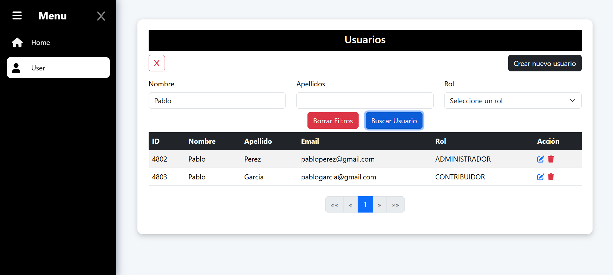

# Gestión de Usuarios - Full Stack App

Aplicación full stack desarrollada con Angular 17 (frontend) y Spring Boot (backend) que permite gestionar usuarios mediante un CRUD completo. La app incluye filtros dinámicos con Criteria API y está diseñada siguiendo buenas prácticas y Clean Architecture para facilitar mantenimiento y escalabilidad.

---

## 🛠 Tecnologías

- **Frontend:** Angular 17, TypeScript, Bootstrap
- **Backend:** Spring Boot, Java 17, JPA Criteria API
- **Base de datos:** MySQL
- **Otros:** Gradle para gestión de dependencias y build

---

## 🏗 Arquitectura y Buenas Prácticas

- Backend organizado siguiendo **Clean Architecture (Arquitectura Limpia)** con capas claras:
    - **Domain:** Lógica del negocio y entidades.
    - **Application:** Casos de uso y lógica de aplicación.
    - **Infrastructure:** Implementaciones técnicas (persistencia, APIs externas).
- Uso de **Criteria API** para filtros dinámicos y consultas flexibles en JPA.
- Implementación de **DTOs (Data Transfer Objects)** para desacoplar entidades y facilitar la comunicación entre capas.
- Aplicación de **inyección de dependencias** para facilitar testeo y modularidad.
- Uso de una carpeta `specs` para centralizar las reglas y filtros del patrón Criteria.
- Frontend modular con Angular 17, utilizando componentes reutilizables y servicios para consumo de APIs REST.

---

### 🔄 Concurrencia optimista e idempotencia

Se implementa control de concurrencia optimista mediante la anotación `@Version` en las entidades del backend, lo que garantiza que no se sobrescriban cambios inesperados cuando varios usuarios intentan modificar el mismo recurso simultáneamente.

Esto permite mantener la integridad de los datos y aporta **idempotencia** en operaciones `PUT`, evitando comportamientos inconsistentes en ediciones concurrentes.

---

## 🎥 Capturas de pantalla

### 📋 Lista de usuarios


### ➕ Crear usuario


### ✏️ Editar usuario


### 🗑️ Borrar usuario


### 🔍 Filtro por nombre


---

## 🚀 Cómo ejecutar el proyecto

### Backend (Spring Boot con Gradle)

Desde la carpeta raíz del proyecto:

```bash
cd api
./gradlew bootRun
```

### Frontend (Angular)
Desde la carpeta raíz del proyecto:

```bash
cd backoffice
npm install
ng serve
```


